# 🏗️ QA-Web-Agent — Full Project Architecture

> **Autonomous end-to-end QA platform** that transforms a URL + PRD into a fully audited, automated, and reported test suite — powered by LangGraph, LangChain-OpenAI, Playwright, and Cypress.

---

## 📁 Project Structure

```
qa-web-agent/
├── langgraph.json              # LangGraph Platform config (graph entry point + env)
├── package.json                # Node.js deps (Cypress)
├── requirements.txt            # Python deps (LangGraph, LangChain, Playwright, FastAPI…)
├── cypress.config.js           # Cypress runner configuration
├── .env                        # API keys + runtime config
│
├── src/                        # ── Python source ──
│   ├── server.py               # FastAPI HTTP server (alternative to langgraph dev)
│   │
│   ├── models/                 # Data layer
│   │   ├── state.py            # LangGraph QAState TypedDict
│   │   └── schemas.py          # Pydantic request/response models
│   │
│   ├── browser/                # Pluggable browser abstraction
│   │   ├── base.py             # Abstract BrowserAdapter + dataclasses
│   │   ├── factory.py          # Env-driven adapter factory
│   │   ├── playwright_adapter.py  # Playwright implementation
│   │   └── webmcp_adapter.py   # WebMCP stub (future)
│   │
│   ├── dom/                    # DOM intelligence
│   │   └── processor.py        # Chunking + map-reduce summarisation
│   │
│   ├── agents/                 # LLM-powered agent nodes
│   │   ├── architect.py        # Phase 1 — Contextual Intelligence
│   │   ├── strategist.py       # Phase 2 — QA Documentation
│   │   ├── sdet.py             # Phase 3 — Cypress Code Generation
│   │   ├── executor.py         # Phase 4 — Test Execution & Verification
│   │   └── reporter.py         # Phase 5 — Markdown Report Generation
│   │
│   └── graph/                  # LangGraph orchestration
│       ├── workflow.py         # StateGraph definition + conditional edges
│       └── checkpointer.py     # Persistence backend factory
│
├── static/
│   └── index.html              # Single-page web UI (SSE + tabbed output)
│
├── cypress/                    # ── Generated test artefacts ──
│   ├── e2e/                    # Generated .cy.js spec files
│   ├── support/
│   │   ├── e2e.js              # Cypress support file
│   │   ├── commands.js         # Custom Cypress commands
│   │   └── pages/              # Generated Page Object files
│   └── screenshots/            # Failure screenshots
│
└── reports/                    # Generated markdown reports
    ├── test_cases_report.md
    └── bug_report.md
```

---

## 🔄 High-Level System Flow

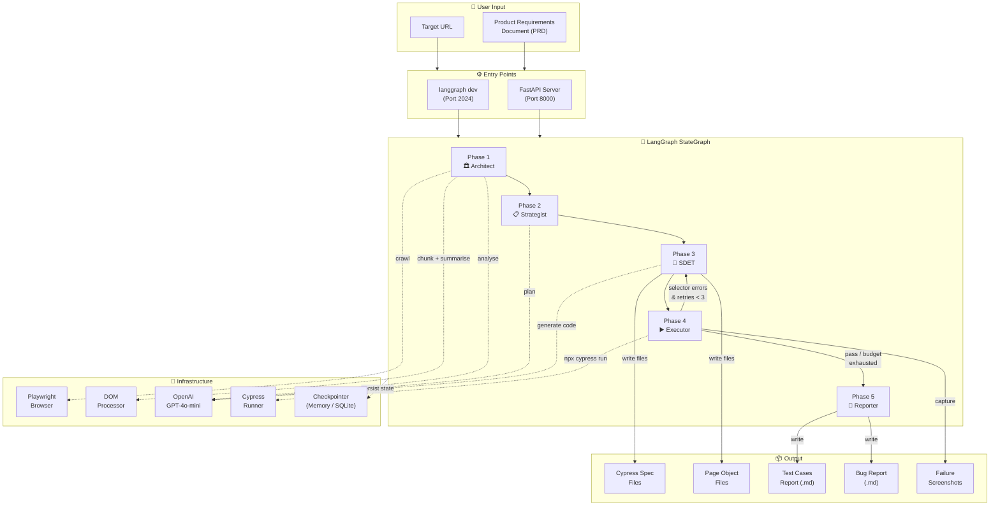

---

## 🧩 Module-by-Module Deep Dive

### 1. Models Layer — `src/models/`

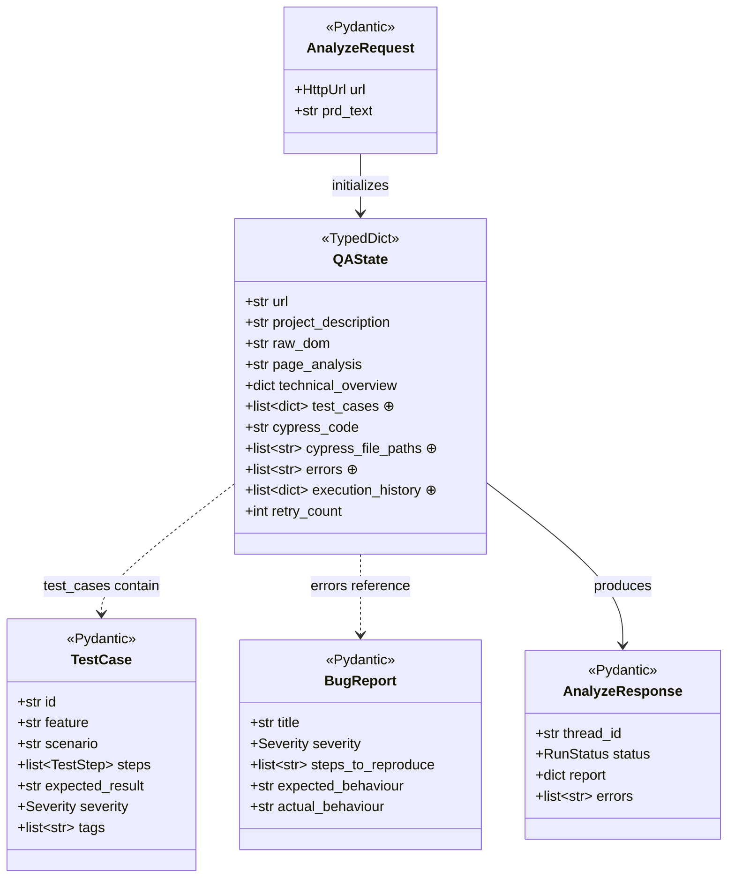

**Purpose**: The shared data contract for the entire system.

| File | Role |
|------|------|
| `state.py` | `QAState` — the single TypedDict that flows through every LangGraph node. Fields marked `⊕` use the `Annotated[list, add]` reducer so each node **appends** rather than overwrites. |
| `schemas.py` | Pydantic models for HTTP request/response validation (`AnalyzeRequest`, `AnalyzeResponse`) plus structured LLM output schemas (`TestCase`, `BugReport`, `POVReport`). |

**How it connects**: Every agent node receives `QAState` as input and returns a partial dict that LangGraph merges back using the field reducers.

---

### 2. Browser Layer — `src/browser/`

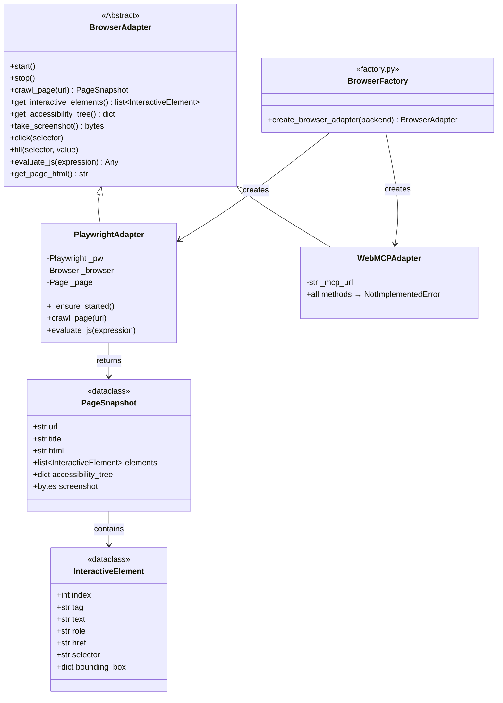

**Purpose**: Pluggable browser abstraction — swap Playwright for WebMCP (or any future adapter) via a single `BROWSER_BACKEND` env var.

| File | Role |
|------|------|
| `base.py` | Defines the `BrowserAdapter` ABC with 10 abstract methods, plus `PageSnapshot` and `InteractiveElement` dataclasses. |
| `factory.py` | `create_browser_adapter()` — reads `BROWSER_BACKEND` from env, returns the matching concrete adapter. |
| `playwright_adapter.py` | Full Playwright implementation. Key features: **lazy auto-start** (`_ensure_started()`), two JS extraction scripts (interactive elements + filtered HTML), accessibility tree snapshot. |
| `webmcp_adapter.py` | Stub for future MCP-based browser control. All methods raise `NotImplementedError`. |

**How it connects**:
- The **Architect agent** calls `browser.crawl_page(url)` to get a `PageSnapshot`.
- The **DOM Processor** calls `browser.evaluate_js()` to extract filtered HTML.
- `_ensure_started()` enables **langgraph dev** compatibility (no explicit lifecycle management needed).

---

### 3. DOM Layer — `src/dom/processor.py`

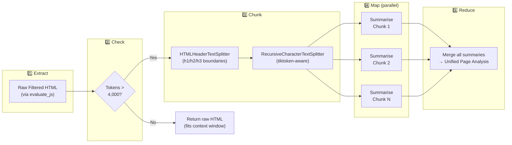

**Purpose**: Intelligently manages the DOM context window for LLM processing.

| Component | What it does |
|-----------|-------------|
| `extract_dom()` | Runs a JS snippet in the browser to collect only **testable** HTML elements (buttons, links, inputs, headings, landmarks, ARIA, data-* attributes). |
| `count_tokens()` / `needs_chunking()` | Uses **tiktoken** (lazy-loaded) to check if the filtered DOM exceeds the 4,000-token threshold. |
| `chunk_dom()` | Two-tier splitting: first by HTML headers (h1/h2/h3 semantic boundaries), then by token count using `RecursiveCharacterTextSplitter.from_tiktoken_encoder()`. |
| `summarize_chunks()` | **Map phase**: sends each `DOMChunk` to the LLM with `asyncio.Semaphore(5)` concurrency cap. |
| `merge_summaries()` | **Reduce phase**: combines all chunk summaries into a single unified page analysis. |
| `process_page()` | Orchestrates the full pipeline: extract → check → (chunk → map → reduce) or passthrough. |

**How it connects**: Called by the **Architect agent** during Phase 1. The resulting page analysis string flows into `QAState.page_analysis` and is used by all downstream agents.

---

### 4. Agents Layer — `src/agents/`

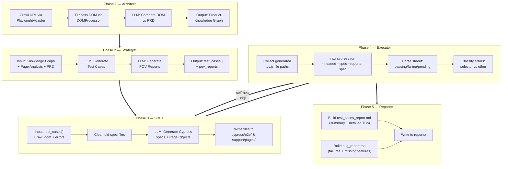

#### Phase 1: Architect (`architect.py`)

| Aspect | Detail |
|--------|--------|
| **Input** | `url`, `project_description` |
| **Process** | 1. Crawls URL via `browser.crawl_page()` → `PageSnapshot` <br/> 2. Processes DOM via `dom_processor.process_page()` → page analysis string <br/> 3. Sends PRD + page analysis to LLM with structured prompt → Product Knowledge Graph |
| **Output** | `raw_dom`, `page_analysis`, `technical_overview` (JSON with implemented/missing features, tech signals, risks) |
| **LLM Prompt** | Senior QA Architect role — maps every PRD requirement to implementation status |
| **Dependencies** | `BrowserAdapter`, `DOMProcessor`, `ChatOpenAI` |

#### Phase 2: Strategist (`strategist.py`)

| Aspect | Detail |
|--------|--------|
| **Input** | `technical_overview`, `page_analysis`, `project_description` |
| **Process** | 1. Generates hierarchical test cases from Knowledge Graph <br/> 2. Generates multi-POV reports (Stakeholder / Developer / User) |
| **Output** | `test_cases` (list of structured TC dicts), updated `technical_overview` with POV reports |
| **LLM Prompts** | Two-chain: Test Plan prompt → POV Report prompt |
| **Dependencies** | `ChatOpenAI` only (no browser needed) |

#### Phase 3: SDET (`sdet.py`)

| Aspect | Detail |
|--------|--------|
| **Input** | `url`, `test_cases`, `page_analysis`, `raw_dom`, `errors` (on retry) |
| **Process** | 1. Cleans old generated files <br/> 2. Generates Cypress specs + Page Objects via LLM <br/> 3. Writes `.js` files to disk |
| **Output** | `cypress_code`, `cypress_file_paths` |
| **Self-Healing** | On retry: injects previous errors + last Cypress stdout + re-crawled DOM into prompt |
| **Key Rules** | CommonJS only, no bare tag selectors, no `cy.intercept`, `.first()` for multi-match, one spec per feature |
| **Dependencies** | `ChatOpenAI`, filesystem |

#### Phase 4: Executor (`executor.py`)

| Aspect | Detail |
|--------|--------|
| **Input** | `cypress_file_paths`, `retry_count` |
| **Process** | 1. Validates spec files exist <br/> 2. Runs `npx cypress run --headed --spec <files> --reporter spec` <br/> 3. Parses regex: `(\d+) passing/failing/pending` <br/> 4. Classifies errors as selector-related or other |
| **Output** | `execution_history` (attempt details), `errors` (selector errors), `retry_count` |
| **Timeout** | 300 seconds |
| **Dependencies** | Node.js + Cypress (subprocess) |

#### Phase 5: Reporter (`reporter.py`)

| Aspect | Detail |
|--------|--------|
| **Input** | Full `QAState` (all accumulated data) |
| **Process** | 1. Builds `test_cases_report.md` with summary table, app overview, detailed TCs with severity badges <br/> 2. Builds `bug_report.md` with execution summary, missing features (BUG-M###), test failures (BUG-T###) |
| **Output** | `cypress_file_paths` (appends report file paths) |
| **Dependencies** | Filesystem only (no LLM calls) |

---

### 5. Graph Layer — `src/graph/`

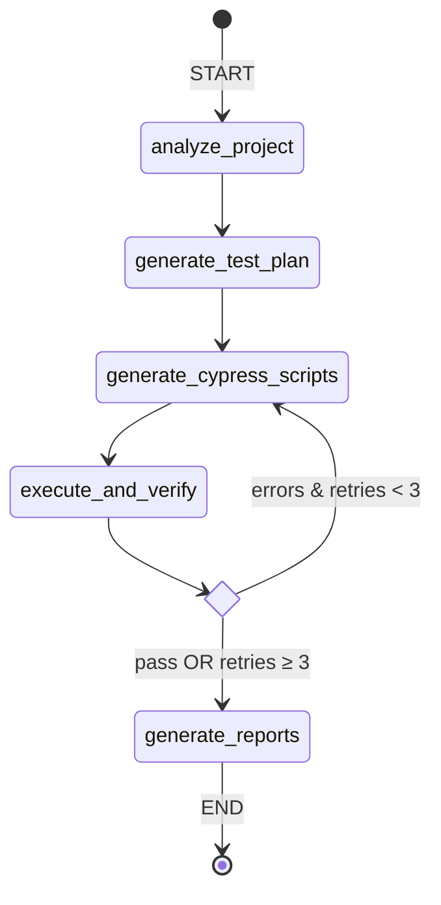

#### `workflow.py`

| Component | Role |
|-----------|------|
| `build_graph()` | Full graph construction with explicit browser + DOM processor injection. Used by `server.py`. |
| `create_graph()` | **Zero-arg factory** for `langgraph dev`. Creates default browser + DOM processor internally. Referenced in `langgraph.json`. |
| `_should_retry()` | Conditional edge function: returns `"retry"` if errors exist and `retry_count < MAX_RETRIES (3)`, else `"done"`. |
| 5 nodes | `analyze_project` → `generate_test_plan` → `generate_cypress_scripts` → `execute_and_verify` → `generate_reports` |
| Self-healing loop | `execute_and_verify` ↔ `generate_cypress_scripts` (up to 3 retries) |

#### `checkpointer.py`

| Function | Backend | Use Case |
|----------|---------|----------|
| `create_checkpointer()` | `MemorySaver` | For `langgraph dev` CLI (zero-arg, synchronous) |
| `create_async_checkpointer()` | `MemorySaver` / `AsyncSqliteSaver` / `AsyncPostgresSaver` | For FastAPI server (async, env-configurable) |

**How it connects**: The checkpointer enables **state persistence** across graph steps, allowing inspection of intermediate results and potential run resumption.

---

### 6. Server Layer — `src/server.py`

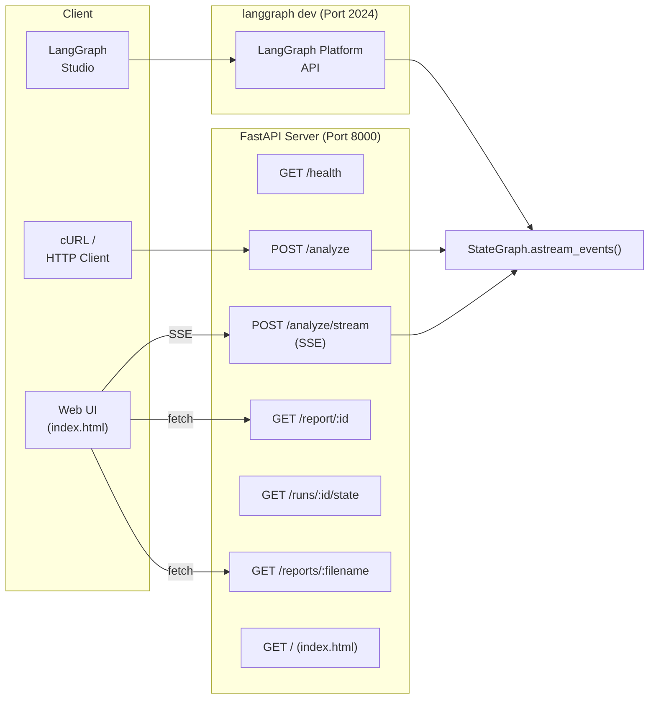

| Endpoint | Method | Purpose |
|----------|--------|---------|
| `/` | GET | Serves the web UI (`static/index.html`) |
| `/health` | GET | Liveness probe |
| `/analyze` | POST | Synchronous full graph run, returns final result |
| `/analyze/stream` | POST | **SSE streaming** — emits `on_chain_start/end/stream` events in real-time |
| `/report/{thread_id}` | GET | Fetches final state of a completed run (uses `aget_state()`) |
| `/runs/{thread_id}/state` | GET | Raw graph state inspection for debugging |
| `/reports/{filename}` | GET | Serves generated markdown report files |

**Two entry points**:
- **`langgraph dev`** (port 2024) — uses `langgraph.json` → `create_graph()`, exposes LangGraph Platform API, works with LangGraph Studio.
- **`uvicorn src.server:app`** (port 8000) — uses `build_graph()` with explicit lifecycle management, serves custom web UI with SSE.

---

### 7. Frontend — `static/index.html`

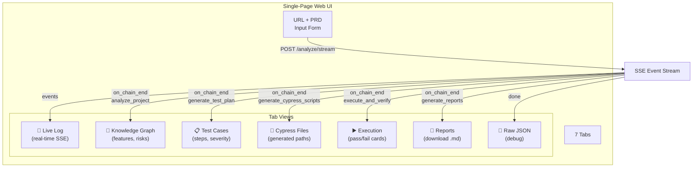

---

## 🔗 Complete Data Flow

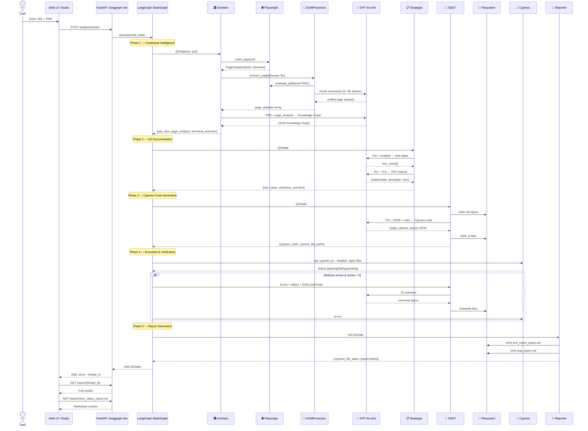

---

## ⚙️ Configuration & Environment

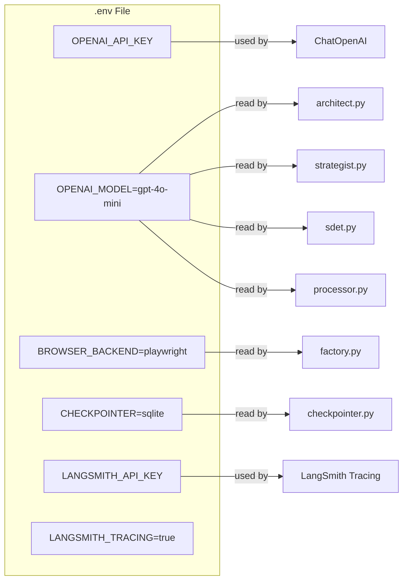

| Variable | Default | Used By | Purpose |
|----------|---------|---------|---------|
| `OPENAI_API_KEY` | — | All agents | OpenAI API authentication |
| `OPENAI_MODEL` | `gpt-4o-mini` | All agents + DOMProcessor | Which LLM model to use |
| `BROWSER_BACKEND` | `playwright` | `factory.py` | Select browser adapter |
| `CHECKPOINTER` | `memory` | `checkpointer.py` | Persistence backend |
| `LANGSMITH_TRACING` | `true` | `@traceable` decorators | Enable LangSmith observability |
| `LANGSMITH_API_KEY` | — | LangSmith SDK | LangSmith authentication |

---

## 🔄 Self-Healing Loop Detail

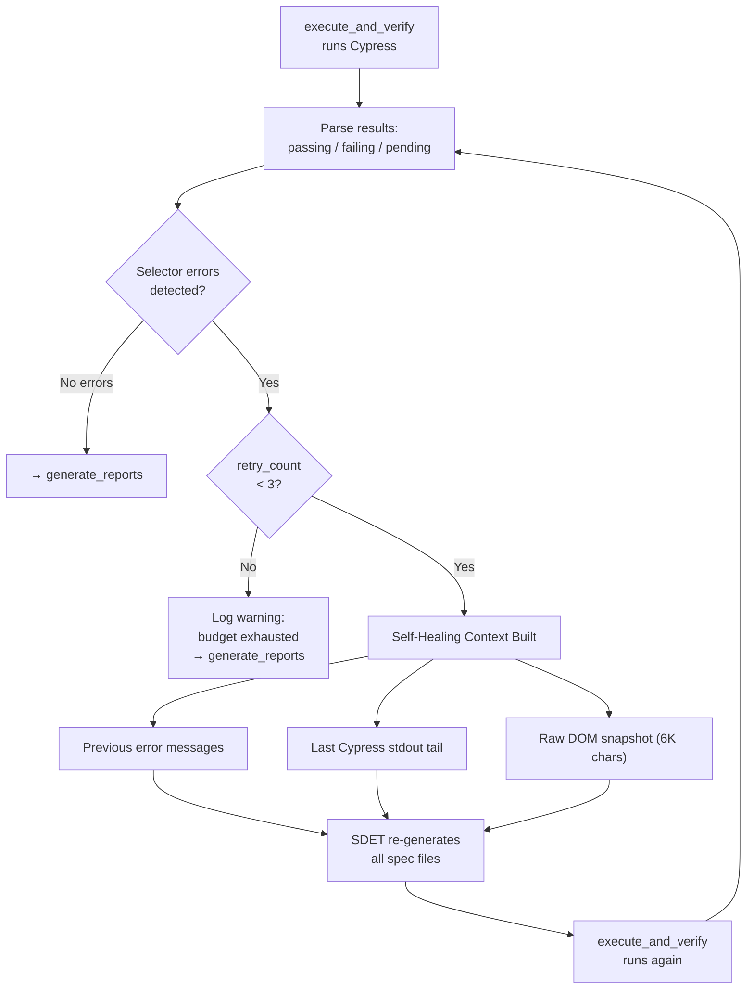

**Error classification patterns**:
- `Timed out retrying after` → Selector error
- `Expected to find element` → Selector error
- `cy.get() failed` → Selector error
- `AssertionError` → Assertion error
- `CypressError` → Runtime error

---

## 🚀 How to Run

### Option A: LangGraph Dev (Recommended)

```bash
# 1. Activate venv
source venv/bin/activate

# 2. Start LangGraph dev server
langgraph dev --no-browser

# 3. Open LangGraph Studio
# → https://smith.langchain.com/studio/?baseUrl=http://127.0.0.1:2024

# 4. Send input:
# {
#   "url": "https://example.com",
#   "project_description": "Description of the app..."
# }
```

### Option B: FastAPI Server + Web UI

```bash
# 1. Activate venv
source venv/bin/activate

# 2. Start FastAPI server
uvicorn src.server:app --reload --port 8000

# 3. Open web UI
# → http://localhost:8000
```

---

## 📊 Technology Stack

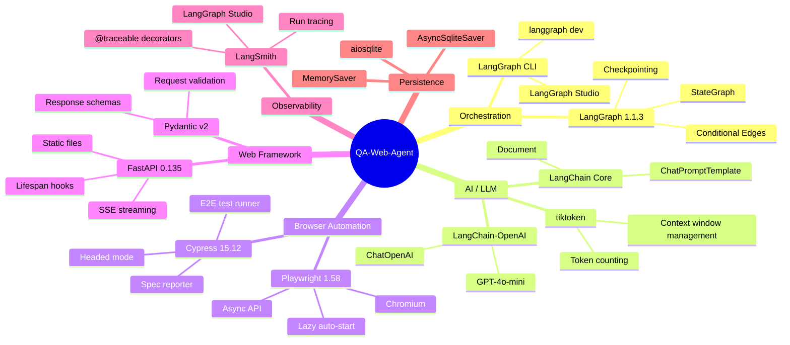

---

## 🔑 Key Design Decisions

| Decision | Rationale |
|----------|-----------|
| **Pluggable browser adapter** | Swap Playwright ↔ WebMCP without touching agent code |
| **Lazy auto-start** (`_ensure_started`) | Enables `langgraph dev` usage without explicit lifecycle management |
| **Map-reduce DOM processing** | Handles large pages that exceed LLM context windows |
| **Lazy tiktoken initialization** | Avoids blocking I/O during ASGI startup |
| **Annotated reducers** on `QAState` | Each node appends to shared lists instead of overwriting |
| **Two entry points** (FastAPI + langgraph dev) | Development flexibility — use Studio or custom UI |
| **CommonJS-only Cypress generation** | Cypress doesn't support ES modules by default |
| **One spec per feature** | Easier debugging, cleaner self-healing |
| **Self-healing with full context** | Injects errors + stdout + DOM so LLM can fix selectors accurately |
| **`@traceable` on every agent** | Full observability via LangSmith |

---

*Architecture document generated for QA-Web-Agent v0.1.0*
